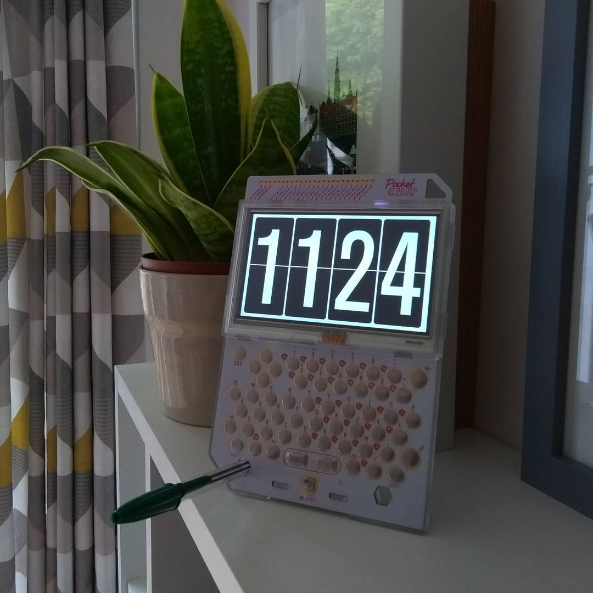

# pygame-flipclock

A simple, fullscreen retro flip-style clock. Uses [pygame](https://www.pygame.org) (which runs on top of [SDL](http://www.libsdl.org/) so should be pretty portable and run anywhere those things are installable.

Currently fixed to the resolution of the [PocketC.H.I.P.](https://getchip.com/pages/pocketchip) screen, but it's my intention to make it responsive in the near future.

